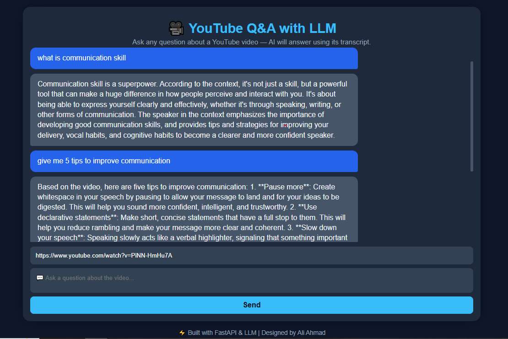
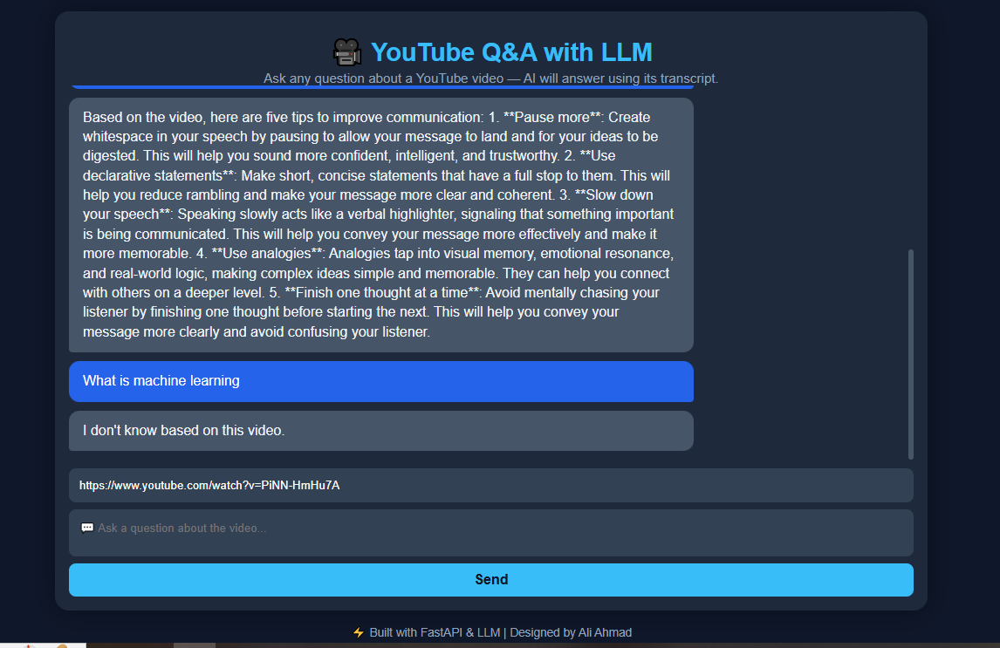

# 🎥 YouTube Q&A Chatbot with LLM

This is a **YouTube Q&A Chatbot** powered by a Large Language Model (LLM) and FastAPI.  
Users can enter a YouTube video URL and ask questions — the system generates accurate answers using the video transcript.

---

## 🔹 Features

- Ask questions about any YouTube video.
- Extracts video transcript automatically.
- Generates answers using an LLM (Hugging Face API or other supported models).
- **Clean and responsive UI** similar to ChatGPT:
  - Fixed input box at the bottom
  - Scrollable chat messages
  - Enter key or send button to submit queries
- Frontend built with **HTML, CSS, and JavaScript**
- Backend built with **FastAPI** and Python
- CORS enabled for frontend-backend communication

---

## 📂 Project Structure

youtube-transcript-rag/
│
├─ frontend/
│   ├─ index.html         # Chatbot UI
│   ├─ style.css          # Stylesheet
│   └─ script.js          # JS logic
│
├─ utils/
│   ├─ youtube_utils.py   # Functions to extract video ID & transcript
│   └─ qa_pipeline.py     # Functions to generate answers from transcript
│
├─ model/
│   └─ Youtube_RAG_System.ipynb   # Notebook for initial experimentation
│
├─ main.py                # FastAPI backend
├─ requirements.txt       # Python dependencies
└─ .env                   # Hugging Face API token (local only, not pushed)

## ⚡ How it Works

1. **User enters a YouTube URL** and their question in the chatbot UI.
2. Frontend sends a POST request to the FastAPI backend at `/youtube_qa`.
3. Backend uses `youtube_utils.py` to:
   - Extract the video ID from the URL
   - Fetch the transcript of the video
4. The transcript and user query are sent to `qa_pipeline.py` which:
   - Uses an LLM to generate a relevant answer
5. Backend returns the answer as JSON
6. Frontend displays the user question and bot answer in the chat window.

---

## 🖼️ Screenshots

### Chatbot UI Form Example 1


### Chatbot UI Form Example 2


---

## 💻 Installation

### 1. Clone the repository:
```bash
git clone https://github.com/aliahmad552/youtube-transcript-rag.git
cd youtube-transcript-rag
```
### 2.Create a virtual environment:
```bash
python -m venv myenv
myenv\Scripts\activate   # Windows
```


### 3.Install dependencies:
```bash
pip install -r requirements.txt
```

### 4.Create a .env file in the root folder and add your Hugging Face API token:
```bash
HUGGINGFACEHUB_API_TOKEN=hf_your_token_here
```

### 5.Run FastAPI backend:
```bash
uvicorn main:app --reload
```

### 6.Open frontend/index.html in your browser or serve via a local server.

## 🚀 Usage

Open the chatbot UI

Paste a YouTube video URL

Type your question

Press Enter or click the send icon

Chatbot generates answer in real-time

## 🛡️ Security Note

Do NOT commit .env or API tokens to GitHub.

Add .env to .gitignore to avoid accidental exposure.

## 📝 Technologies Used

Python 3.10+

FastAPI

JavaScript, HTML, CSS

Hugging Face LLM APIs

YouTube Transcript API

Chatbot UI inspired by ChatGPT
##📌 Future Improvements

Dark mode UI

Multi-language support

Save conversation history

Deploy as a full web application

Support for multiple LLM providers

## Author

Ali Ahmad – BS Software Engineering

